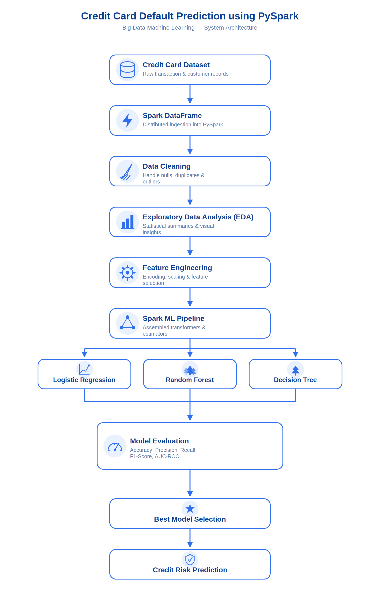
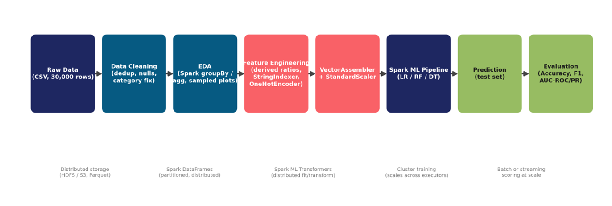

# Credit Card Default Prediction using PySpark

## Overview

This project was developed as a Big Data Machine Learning pair project for the Big Data Analytics module.

The objective is to predict whether a customer will default on their next credit card payment using PySpark and Spark ML.

---

## Team Members

- Rads Bandara (31834)
- M.A.M. Risky (31839)

---

## Dataset

Default of Credit Card Clients Dataset (UCI Machine Learning Repository)

- Records: 30,000
- Features: 24
- Target Variable:
  - 0 = No Default
  - 1 = Default

Dataset Location:

```text
Data Set/default_of_credit_card_clients.csv
```

---

## Technologies Used

- Python
- PySpark
- Spark ML
- Pandas
- NumPy
- Matplotlib
- Seaborn
- Jupyter Notebook

---

## Project Structure

```text
Credit-Card-Default-Prediction-PySpark
│
├── Data Set
├── Images
├── notebook
├── presentation
├── report
├── README.md
├── requirements.txt
└── .gitignore
```

---

## System Architecture



---

## Spark ML Pipeline



---

## Project Workflow

1. Data Loading using Spark DataFrames
2. Data Cleaning
3. Exploratory Data Analysis
4. Feature Engineering
5. Spark ML Pipeline
6. Model Training
7. Model Evaluation
8. Model Comparison

---

## Machine Learning Models

- Logistic Regression
- Random Forest
- Decision Tree

---

## Evaluation Metrics

- Accuracy
- Precision
- Recall
- F1-Score
- AUC-ROC

---

## Key Findings

- Repayment history was the strongest predictor of default risk.
- Random Forest achieved the best overall performance.
- Spark ML Pipeline enabled scalable machine learning processing.

---

## Big Data Concepts

This project demonstrates:

- Distributed Data Processing
- Spark DataFrames
- Spark ML Pipelines
- Scalability for large datasets
- Parallel Processing

The same workflow can be extended to millions of records using Spark clusters and distributed storage systems such as HDFS and cloud data lakes.

---

## Academic Purpose

This project was developed for the Big Data Analytics module as part of the BSc (Hons) Data Science degree program at NSBM Green University.